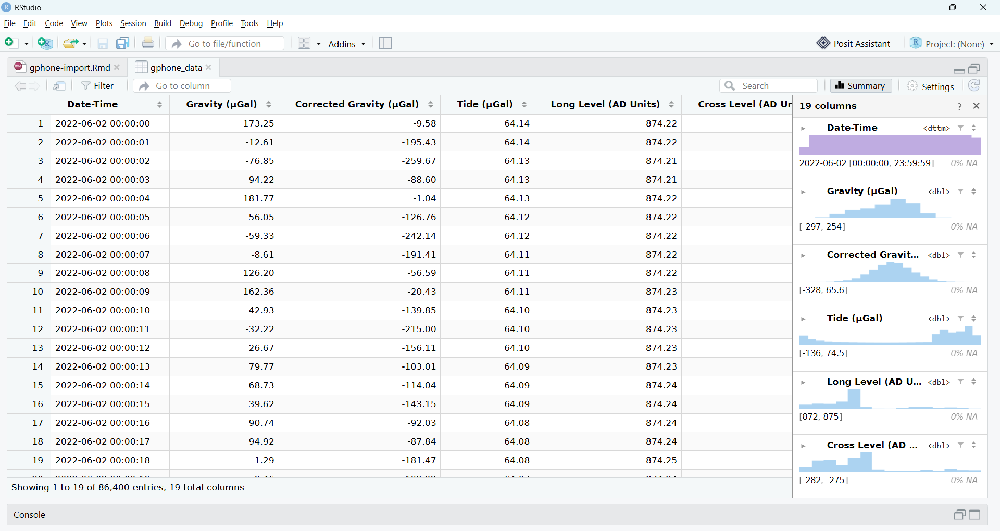

# An R data parser for the gPhone gravity meter

 

This repository holds digital assets associated with the article "An R data
parser for the gPhone gravity meter" [[1](#references)]. That article describes
R Markdown designed to parse and import gPhone 74 gravity meter data into
RStudio. Users may then inspect and analyse the data further using RStudio's
Data Viewer or R scripting.

---

<figure>
  <picture>
    <source media="(prefers-color-scheme: dark)" srcset="assets/gphone-gravimetry-data-in-rstudio-dark-mode.png">
    
  </picture>
   
  <figcaption>
    Figure 1. Example gPhone 74 gravity meter data parsed into an R dataframe.</figcaption>
</figure>

---

## Table of Contents

- [Key Files](#key-files)
- [Software Requirements](#software-requirements)
- [Quality Assurance](#quality-assurance)
- [Getting Started](#getting-started)
- [Acknowledgements](#acknowledgements)
- [References](#references)

## Key Files

| File                            | Notes                          |
| :------------------------------ | :----------------------------- |
| `data/gphone-074-test-data.tsf` | gPhone 74 test data (14.6 MB). |
| `src/gphone-import.Rmd`         | R Markdown.                    |

## Software Requirements

| Software | Notes                                                                                        |
| :------- | :------------------------------------------------------------------------------------------- |
| R        | [Available here](https://www.r-project.org/). Free.                                          |
| RStudio  | [Available here](https://posit.co/products/open-source/rstudio). Free and fee-based options. |

### R Configuration

Please ensure the R environment has the following packages installed.

- dplyr
- lubridate
- readr
- rmarkdown
- rstudioapi

Please ensure their dependencies are also installed.

Dependencies

- base64enc
- bit
- bit64
- bslib
- cachem
- clipr
- cpp11
- crayon
- digest
- evaluate
- fastmap
- <!-- textlint-disable terminology -->fontawesome<!-- textlint-enable terminology -->
- fs
- generics
- hms
- highr
- htmltools
- jquerylib
- jsonlite
- knitr
- memoise
- <!-- textlint-disable terminology -->mime<!-- textlint-enable terminology -->
- pillar
- pkgconfig
- prettyunits
- progress
- R6
- rappdirs
- <!-- textlint-disable terminology -->sass<!-- textlint-enable terminology -->
- tibble
- tidyselect
- timechange
- tinytex
- tzdb
- utf8
- vroom
- withr
- xfun
- <!-- textlint-disable terminology -->yaml<!-- textlint-enable terminology -->

## Quality Assurance

The data parser was tested in the following environment.

Windows Test Environment

 

| Type      | Component                  | Version                                |
| :-------- | :------------------------- | :------------------------------------- |
| Platform  | Operating system           | Windows 11, 25H2 (OS Build 26200.8894) |
| Software  | R                          | 4.6.1                                  |
| &quot;    | RStudio                    | 2026.07.0 (Build 139)                  |
| R package | dplyr                      | 1.2.1                                  |
| &quot;    | lubridate                  | 1.9.5                                  |
| &quot;    | readr                      | 2.2.0                                  |
| &quot;    | rmarkdown                  | 2.31                                   |
| &quot;    | rstudioapi                 | 0.19.0                                 |
| Data      | `gphone-074-test-data.tsf` | Repository dataset.                    |

## Getting Started

The file `gphone-import.Rmd` should be run from RStudio.

The R Markdown file is designed to parse and import gPhone 74 gravimetry data in
time series format (TSF). When run, the R Markdown file prompts users to select
a TSF file to import.

The file `gphone-074-test-data.tsf`, supplied in this repository, holds example
time series data that may be used to test the parser.

## Acknowledgements

This work was supported by the Australian Research Council Training Centre in
Data Analytics for Resources and Environments (project ICI9010031).

## References

1. T. Stenborg and S. Legge, "An R data parser for the gPhone gravity meter",
   _Preview_, no. 234, p. 30, Feb. 2025, doi: 10.63929/14432471.2025-234-19.\
   [View PDF](https://www.aseg.org.au/public/200/files/digital-library-files/pv234.pdf)
   &nbsp; [EarthDoc](https://doi.org/10.63929/14432471.2025-234-19)
